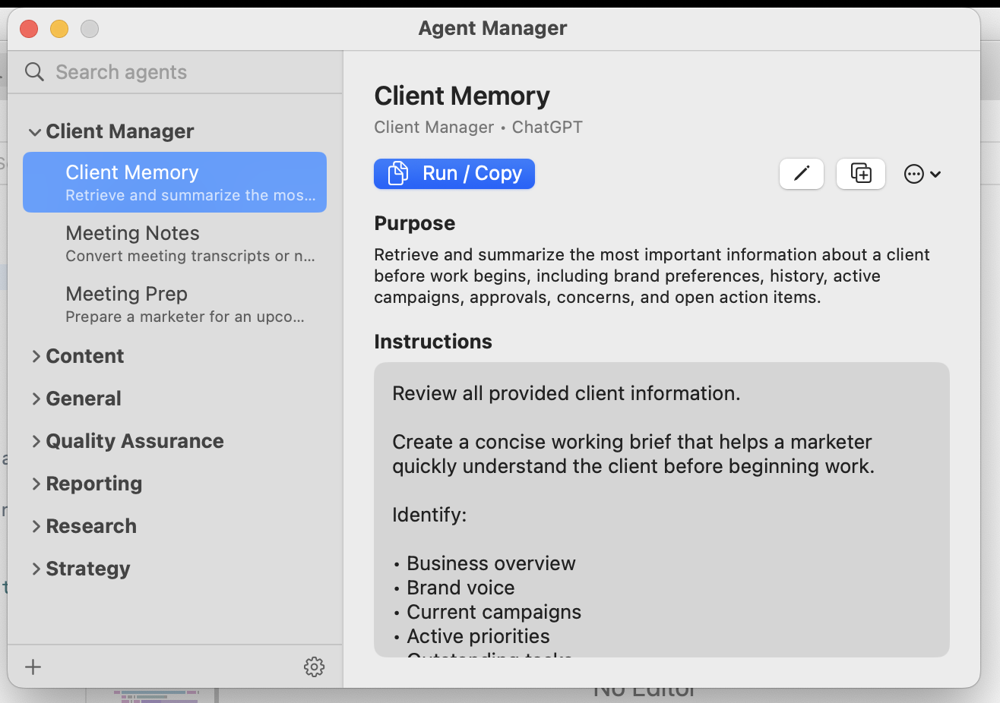

# Agent Manager

<p align="center">
  
</p>

Agent Manager is a native macOS menu bar utility for organizing reusable AI agents and instruction sets. It keeps your prompts, roles, and capabilities in one local, well-structured library — always a hotkey away — so you can find the right instructions and copy them into whatever tool you're using.

It is capability-first: you think in terms of what an agent *does*, not where a file lives. The app organizes and copies instructions; it does not run agents itself.

## Product Description

Agent Manager treats your collection of AI instructions as a first-class library rather than a folder of loose text files. Each entry is an agent — a named capability with a clear purpose and a set of instructions — grouped into categories you control.

The mental model is intentionally simple:

```
Agent Library → Category → Agent / Capability → Instructions
```

You browse the library from the menu bar or a global hotkey window, drill into a category, select the agent you need, review its purpose and instructions, and copy the instructions to your clipboard with a single action. Everything is stored locally and stays on your machine.

## Key Features

- **Menu bar utility** — lives in the macOS menu bar; click the status item to open the library.
- **Global hotkey window** — `Control + Option + Space` brings the same library forward from anywhere, and orders it away when it is already up front.
- **Category-based library** — organize agents into categories that match how you actually work.
- **Search** — filter the library by agent name and category as you type.
- **Purpose & Instructions detail view** — each agent shows a concise purpose and its full instructions.
- **Run / Copy** — copies the agent's instructions to the clipboard so you can paste them into your AI tool of choice.
- **Local settings** — manage shared categories and preferred AI / tool options in one place.
- **Safe category management** — rename categories or delete them; agents in a deleted category are safely reassigned to **General**, and the default category cannot be removed.
- **Agent Pack import / export** — exchange agents through a versioned JSON format, with preview before apply and clipboard export.
- **Local-first storage** — agents and options are persisted as JSON in your Application Support directory.
- **No backend, by design** — no account, no cloud sync, no browser injection, and no model/API execution.

## Architecture

Agent Manager is a native macOS app built with SwiftUI and a small amount of AppKit where the platform requires it.

Both entry points render the **same** UI through one shared surface, so there is no divergent menu-bar/hotkey code path:

```
MenuBarExtra  → ContentView → AgentBrowserView
Hotkey NSWindow → ContentView → AgentBrowserView
```

- The menu bar item uses `MenuBarExtra` in `.window` style.
- The global hotkey opens a real, reused `NSWindow` hosting the same `ContentView`. A dedicated window is used because a `MenuBarExtra` popover cannot be opened programmatically; reusing the window also keeps any in-progress edits intact when you switch apps to copy and paste.
- Settings and data are stored locally; there is no server component.

## Data and Storage

Agent Manager is local-first. State is persisted as plain JSON under:

```
~/Library/Application Support/AgentManager/
├── agents.json     # the agent library
└── options.json    # shared categories and preferred AI / tool options
```

Each agent is a small, self-describing record. At a high level its fields are:

- `name` — the agent / capability name
- `category` — the group it belongs to (defaults to `General`)
- `preferredAI` — the AI or tool the instructions are written for
- `description` / purpose — a concise summary of what the agent is for
- `prompt` / instructions — the full instruction text
- timestamps — `createdAt` and `updatedAt`

The JSON model decodes defensively: older records that predate the `category` or `preferredAI` fields load cleanly, defaulting to `General` and a sensible preferred tool.

## Agent Packs

Agent Packs are a versioned JSON exchange format for moving agents in and out of the library.

- The data layer supports library-, category-, and agent-oriented packs.
- The Settings UI supports a paste → **preview** → apply import flow, and a one-click clipboard export of the current library.
- Imports are always previewed before they are applied, so you can see exactly what will be added or updated.
- Malformed or unsupported packs are rejected safely, without touching the existing library.
- Import is exchange-only: it does not change the core `agents.json` schema.

## Privacy and Boundaries

Agent Manager is deliberately narrow in scope. It is a local organizer for instructions, not an automation platform or an agent runner.

- No account system.
- No backend service.
- No cloud sync.
- No browser injection or page automation.
- No model or API execution.

The app organizes your agents and copies their instructions to the clipboard. Running those instructions is left to whatever AI tool you choose to paste them into.

## Development

Requires Xcode (macOS).

Open in Xcode:

```bash
open AgentManager.xcodeproj
```

Build from the command line:

```bash
xcodebuild -project AgentManager.xcodeproj -scheme AgentManager -destination 'platform=macOS' build
```

Run the tests:

```bash
xcodebuild -project AgentManager.xcodeproj -scheme AgentManager -destination 'platform=macOS' test
```

## Repository Structure

```
AgentManager/
├── AgentManager/             # App source
│   ├── Data/                 # AgentVault, JSON stores, options, Agent Packs
│   ├── Models/               # Agent and related value types
│   ├── Views/                # AgentBrowserView, AgentDetailView, SettingsView, editor
│   ├── Support/              # Window controller, global hotkey, helpers
│   ├── AgentManagerApp.swift # App entry point and menu bar scene
│   └── ContentView.swift     # Shared surface hosting the agent browser
├── AgentManagerTests/        # XCTest unit tests
├── docs/                     # Project docs, architecture notes, and assets
└── AgentManager.xcodeproj/   # Xcode project
```

## Current Status

Agent Manager is a private, working macOS utility. It is local-first and runs as a menu bar app with a global hotkey window.

The current polish stage is complete: the library, detail view, search, settings, category management, and Agent Pack import/export are in place. App Store packaging and code signing are out of scope for now and can be revisited later if needed.
